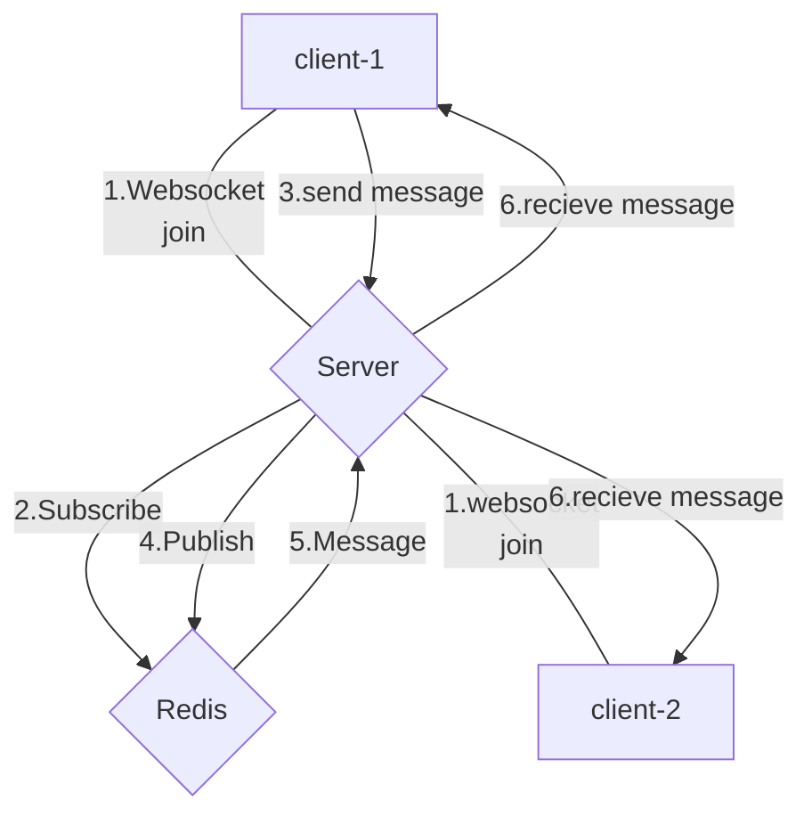

# go-websocket-demo
Websocket & Redis Pubsub Golang untuk Chatting

## Libraries used
1. Redis
2. Gin Framework
3. Gorilla Websocket

## Usage

```bash
$ make start
```

http://localhost:13333/

```bash
$ make stop
```


## Flow



### reference
https://medium.com/@thomi.algh/websocket-redis-pubsub-golang-untuk-chat-80513b880550